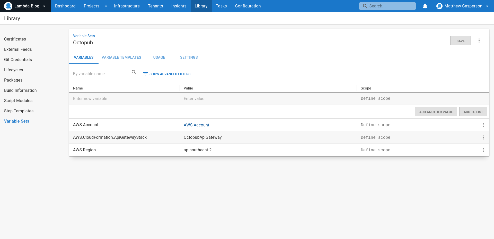
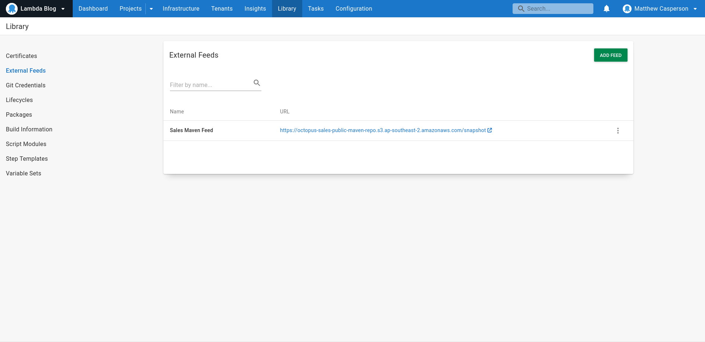
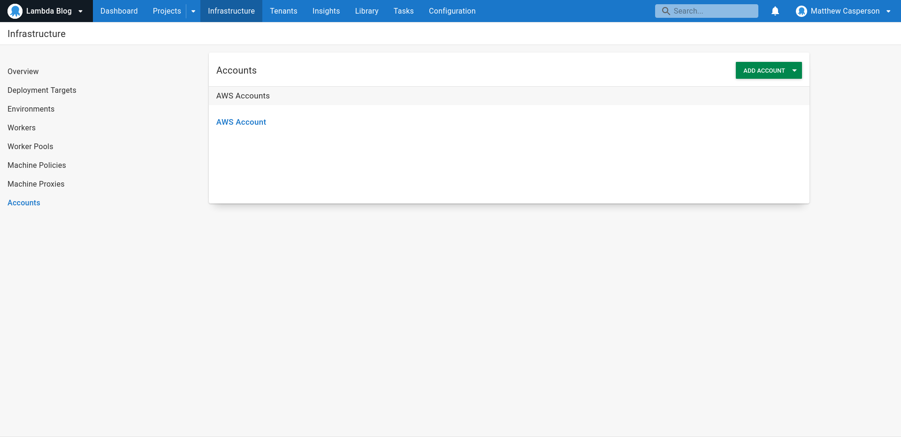
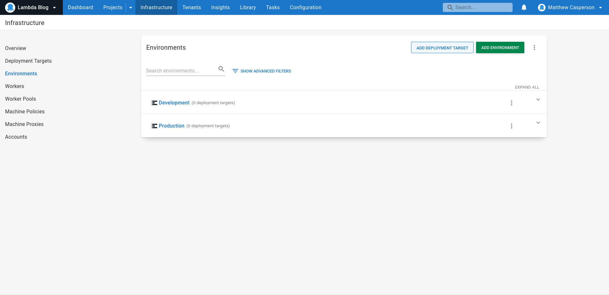

# AWS Lambda Deployment with Octopus

This repo holds three sample Terraform projects using the [Octopus Terraform provider](https://registry.terraform.io/providers/OctopusDeployLabs/octopusdeploy/latest/docs)
to build twi Octopus projects:

* API Gateway - which builds a shared API Gateway that Lambdas are attached to
* Backend Service - A sample REST API backend Lambda exposed via API Gateway

## Applying the Terraform configuration

Each of the three Terraform projects is applied in order to build the API Gateway and Lambda deployment projects.

### Applying the shared configuration

The first step is to apply the Terraform configuration representing shared Octopus resources like library variable sets,
accounts, feeds, and environments. You must define the value of the following variables:

* `octopus_server` is the URL of your Octopus instance.
* `octopus_apikey` is an [API key](https://octopus.com/docs/octopus-rest-api/how-to-create-an-api-key) used to interact with the Octopus instance.
* `octopus_space_id` is the ID of the [space](https://octopus.com/docs/administration/spaces) that the Terraform configuration is applied to.

Run the following commands to initialize and apply the shared Terraform configuration:

```bash
cd shared
terraform init
terraform apply \
  -var=octopus_server=http://yourinstancegoeshere.octopus.app \
  -var=octopus_apikey=API-YOURAPIKEYGOESHERE \
  -var=octopus_space_id=Spaces-1
```

### Applying the API Gateway project configuration

Run the following commands to initialize and apply the API Gateway Terraform configuration:

```bash
cd apigateway
terraform init
terraform apply \
  -var=octopus_server=http://yourinstancegoeshere.octopus.app \
  -var=octopus_apikey=API-YOURAPIKEYGOESHERE \
  -var=octopus_space_id=Spaces-1
```

### Applying the Lambda project configuration

Run the following commands to initialize and apply the API Gateway Terraform configuration:

```bash
cd backend
terraform init
terraform apply \
  -var=octopus_server=http://yourinstancegoeshere.octopus.app \
  -var=octopus_apikey=API-YOURAPIKEYGOESHERE \
  -var=octopus_space_id=Spaces-1
```

## Breaking down the Terraform configuration files

Each of the three Terraform projects contains a Terraform configuration file. This file creates resources exposed by the
Octopus Terraform provider. Let's break one of these configuration files down to see how they work.

We start by requiring the Octopus Terraform provider. Note that the version of the provider is fixed. This is important
as the provider is still a zero-version release, meaning breaking changes may be introduced with any updates. By keeping
the version fixed, we can be assured that our configuration file will behave consistently until we choose to use a new
version of the provider:

```terraform
terraform {
  required_providers {
    octopusdeploy = { source = "OctopusDeployLabs/octopusdeploy", version = "0.10.1" }
  }
}
```

The Octopus Terraform provider is configured to connect to a specified server, with an API key, and to configure resources
in a specific space. Each of these values is defined in a Terraform variable:

```terraform
provider "octopusdeploy" {
  address  = "${var.octopus_server}"
  api_key  = "${var.octopus_apikey}"
  space_id = "${var.octopus_space_id}"
}
```

Here are the three variables consumed by the provider configuration above:

```terraform
variable "octopus_server" {
  type        = string
  nullable    = false
  sensitive   = false
  description = "The URL of the Octopus server e.g. https://myinstance.octopus.app."
}
variable "octopus_apikey" {
  type        = string
  nullable    = false
  sensitive   = true
  description = "The API key used to access the Octopus server. See https://octopus.com/docs/octopus-rest-api/how-to-create-an-api-key for details on creating an API key."
}
variable "octopus_space_id" {
  type        = string
  nullable    = false
  sensitive   = false
  description = "The ID of the Octopus space to populate."
}
```

We can now define the Octopus resources we wish Terraform to manage for us. This resource creates a Maven feed in Octopus:

```terraform
resource "octopusdeploy_maven_feed" "sales_maven_feed" {
  download_attempts              = 10
  download_retry_backoff_seconds = 20
  feed_uri                       = "https://octopus-sales-public-maven-repo.s3.ap-southeast-2.amazonaws.com/snapshot"
  name                           = "Sales Maven Feed"
}
```

These two resources create environments called `Development` and `Production`:

```terraform
resource "octopusdeploy_environment" "environment_development" {
  name                         = "Development"
  description                  = "An environment for the development team."
  allow_dynamic_infrastructure = true
  use_guided_failure           = false
  sort_order                   = 0

  jira_extension_settings {
    environment_type = "unmapped"
  }

  jira_service_management_extension_settings {
    is_enabled = false
  }

  servicenow_extension_settings {
    is_enabled = false
  }
}

resource "octopusdeploy_environment" "environment_production" {
  name                         = "Production"
  description                  = "The production environment."
  allow_dynamic_infrastructure = true
  use_guided_failure           = false
  sort_order                   = 0

  jira_extension_settings {
    environment_type = "unmapped"
  }

  jira_service_management_extension_settings {
    is_enabled = false
  }

  servicenow_extension_settings {
    is_enabled = false
  }
}
```

This resource creates a library variable set:

```terraform
resource "octopusdeploy_library_variable_set" "library_variable_set_octopub" {
  name        = "Octopub"
  description = ""
}
```

This resource creates an AWS account. Note that the access and secret keys are exposed as Terraform variables:

```terraform
resource "octopusdeploy_aws_account" "account_aws_account" {
  name                              = "AWS Account"
  description                       = ""
  environments                      = []
  tenant_tags                       = []
  tenants                           = null
  tenanted_deployment_participation = "Untenanted"
  access_key                        = "${var.account_aws_account_access}"
  secret_key                        = "${var.account_aws_account}"
}
variable "account_aws_account" {
  type        = string
  nullable    = false
  sensitive   = true
  description = "The AWS secret key associated with the account AWS Account"
}
variable "account_aws_account_access" {
  type        = string
  nullable    = false
  sensitive   = true
  description = "The AWS access key associated with the account AWS Account"
}
```

The AWS account above is captured in a variable called `AWS.Account` assigned to the library variable set:

```terraform
resource "octopusdeploy_variable" "library_variable_set_octopub_aws_region_1" {
  owner_id     = "${octopusdeploy_library_variable_set.library_variable_set_octopub.id}"
  value        = "${var.library_variable_set_octopub_aws_region_1}"
  name         = "AWS.Region"
  type         = "String"
  description  = ""
  is_sensitive = false

  scope {
    actions      = []
    channels     = []
    environments = []
    machines     = []
    roles        = null
    tenant_tags  = null
  }
  depends_on = []
}
```

A second variable called `AWS.Region` is created and assigned to the library variable set. The value for this Octopus variable
is defined in a Terraform variable to allow it to be overridden:

```terraform
variable "library_variable_set_octopub_aws_region_1" {
  type        = string
  nullable    = false
  sensitive   = false
  description = "The value associated with the variable AWS.Region"
  default     = "ap-southeast-2"
}
resource "octopusdeploy_variable" "library_variable_set_octopub_aws_region_1" {
  owner_id     = "${octopusdeploy_library_variable_set.library_variable_set_octopub.id}"
  value        = "${var.library_variable_set_octopub_aws_region_1}"
  name         = "AWS.Region"
  type         = "String"
  description  = ""
  is_sensitive = false

  scope {
    actions      = []
    channels     = []
    environments = []
    machines     = []
    roles        = null
    tenant_tags  = null
  }
  depends_on = []
}
```

A third variable called `AWS.CloudFormation.ApiGatewayStack` is created and assigned to the library variable set:

```terraform

variable "library_variable_set_octopub_aws_cloudformation_apigatewaystack_0" {
  type        = string
  nullable    = false
  sensitive   = false
  description = "The value associated with the variable AWS.CloudFormation.ApiGatewayStack"
  default     = "OctopubApiGateway"
}
resource "octopusdeploy_variable" "library_variable_set_octopub_aws_cloudformation_apigatewaystack_0" {
  owner_id     = "${octopusdeploy_library_variable_set.library_variable_set_octopub.id}"
  value        = "${var.library_variable_set_octopub_aws_cloudformation_apigatewaystack_0}"
  name         = "AWS.CloudFormation.ApiGatewayStack"
  type         = "String"
  description  = ""
  is_sensitive = false

  scope {
    actions      = []
    channels     = []
    environments = []
    machines     = []
    roles        = null
    tenant_tags  = null
  }
  depends_on = []
}
```


*The library variable set*


*The Maven feed*


*The AWS account*


*The environments*